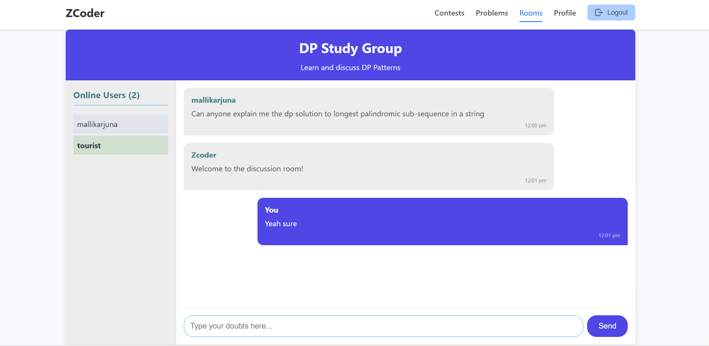

# ZCoder - Collaborative Coding & Problem-Solving Platform

ZCoder is a full-stack web application that allows users to practice coding problems, post and view solutions, bookmark problems, track their progress, and collaborate in real-time rooms using Socket.IO. It supports authentication, user profiles, solution sharing, and live messaging features.

## Live Demo

**Zcoder:** [https://zcoder-tau.vercel.app/](https://zcoder-tau.vercel.app/)  

## Project Previews

### Home Page


## Singup and Login


### Profile Dashboard


### Contest Page


### Rooms Page





### Problems Page


### Solutions


## Tech Stack

### Frontend
- React.js (Vite)
- React Router
- Socket.IO Client
- CSS
- React-Toastify

### Backend
- Node.js + Express.js
- MongoDB (Atlas) + Mongoose
- Socket.IO Server
- Nodemailer to send emails
- JWT Authentication
- Cloudinary API to store profile pics of users
- Clist API to get data of upcomming contests

## Features

### User System
- Signup/Login with JWT auth
- Email verification using OTP
- Profile page with avatar, bio, and stats
- View other users’ profiles

### Problems
- View problem list with filters (difficulty, topic, solved/unsolved)
- Track solved problems via local storage
- Bookmark problems

### Solutions
- Post solution with code editor (supports C++, Java, Python, JS)
- Display solutions by language and approach
- Edit/Delete own solutions

### Rooms (Real-time Chat)
- Create/join rooms based on room IDs
- Real-time messaging via Socket.IO
- Store recent 24 hour messages in MongoDB

## Folder Structure

```
ZCoder/
├── backend/
│   ├── config/
│   ├── controllers/
│   ├── middleware/
│   ├── models/
│   ├── routes/
│   ├── utils/
│   ├── .env
│   └── server.js
├── frontend/
│   ├── public/
│   ├── src/
│   |   ├──assests/
│   |   ├──components/
│   |   ├──pages/
│   |   ├──styles/
│   |   ├──AppRouter.jsx
│   ├── util.js
│   └── index.html
```

## Getting Started Locally

### Prerequisites
- Node.js
- MongoDB Atlas account
- Cloudinary API credentials
- Clist API credentials
- Gmail App pass key

### Backend Setup

```bash
cd backend
npm install
```

Create a `.env` file with:

```
CLIST_USERNAME= your_clist_username
CLIST_API_KEY= your_clist_apikey
PORT = sample_port_of_your_backend 
MONGO_USER = your_mongodb_username
MONGO_PASSWORD = your_mogodb_password
MONGO_URL = your_mongodb_connection_url_you_can_get_it_from_mongodb_atlas
JWT_SECRET= your_server_side_secret_key_for_jwt
GMAIL_USER= your_gmail_to_send_otps
GMAIL_PASS= your_gmail_app_passkey
CLOUDINARY_CLOUD_NAME= your_coludinary_cloud_name_to_store_dp_of_users
CLOUDINARY_API_KEY= your_cloudinary_api_key
CLOUDINARY_API_SECRET= your_cloudinary_api_secret
FRONTEND_URL = your_frontend_base_url 

```

Run backend:

```bash
node server.js
```

### Frontend Setup

```bash
cd frontend
npm install
npm run dev
```

## To-Do / Future Improvements
- Authentication via Google OAuth
- Forgot password or password change feature using verification email
- Add friend feature for users
- Delete user account feature
- Compile and run code in real-time
- Leaderboards & user analytics


## License

All rights reserved.  

This project and its source code are protected. You may not use, copy, modify, distribute, or reproduce any part of this project without explicit written permissions from the author.

© 2025 Annigandla Kameshwara Rao
